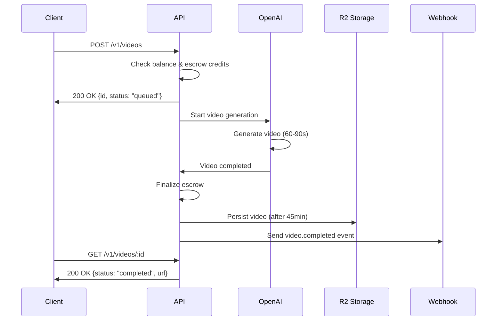

# Video API Overview

Generate AI-powered activist videos using OpenAI's Sora 2 and Sora 2 Pro models.

## Available Models

| Model | Quality | Speed | Cost per Video |
|-------|---------|-------|----------------|
| **sora-2** | Standard (720p) | ~60-90 seconds | $1.25 - $3.75 |
| **sora-2-pro** | Pro (1080p) | ~60-90 seconds | $3.50 - $10.50 |

## Video Specifications

### Durations

Videos can be 4, 8, or 12 seconds long:

- **"4"** seconds - Shortest, cheapest
- **"8"** seconds - Standard duration (recommended)
- **"12"** seconds - Longest, most expensive

<Warning>
  The `seconds` parameter must be a **STRING** ("4", "8", or "12"), not a number!
</Warning>

### Resolutions

| Aspect Ratio | Standard (720p) | HD (1080p) | Pro HD (1792px) |
|--------------|-----------------|------------|-----------------|
| **Landscape** | 1280x720 | Not available | 1792x1024 |
| **Portrait** | 720x1280 | Not available | 1024x1792 |

**Available sizes:**
- `"1280x720"` - Landscape 16:9 (sora-2, sora-2-pro)
- `"720x1280"` - Portrait 9:16 (sora-2, sora-2-pro)
- `"1792x1024"` - Landscape HD (sora-2-pro only)
- `"1024x1792"` - Portrait HD (sora-2-pro only)

### Pricing

Videos are charged based on model, duration, and resolution:

**Sora 2 Standard:**
- 4s: $1.25 (0.5 credits)
- 8s: $2.50 (1 credit)
- 12s: $3.75 (1.5 credits)

**Sora 2 Pro Standard:**
- 4s: $3.50 (1 credit)
- 8s: $7.00 (2 credits)
- 12s: $10.50 (3 credits)

**Sora 2 Pro HD** (1792px resolution):
- 4s: $6.00 (4 credits)
- 8s: $15.00 (6 credits)
- 12s: $22.50 (9 credits)

## Video Generation Flow



## Video Lifecycle

1. **Queued** - Video creation request received, queued for processing
2. **In Progress** - Video actively generating (60-90 seconds)
3. **Completed** - Video ready, URL available
4. **Failed** - Generation failed (error included)

### Video Expiration

- **OpenAI Storage**: Videos stored on OpenAI servers for **1 hour only**
- **R2 Persistence**: Videos automatically persisted to Cloudflare R2 after **45 minutes**
- **Permanent Storage**: Persisted videos available indefinitely

<Info>
  Videos are automatically persisted to R2 storage 45 minutes after creation to ensure they remain available after OpenAI's 1-hour retention window.
</Info>

## Endpoints

| Method | Endpoint | Description |
|--------|----------|-------------|
| **POST** | `/v1/videos` | Create a new video |
| **GET** | `/v1/videos` | List your videos |
| **GET** | `/v1/videos/:id` | Get video status |
| **DELETE** | `/v1/videos/:id` | Delete a video |
| **GET** | `/v1/videos/:id/content` | Download video file |
| **POST** | `/v1/videos/:id/remix` | Create remix from existing video |

## Quick Example

<CodeGroup>

```typescript TypeScript
import OpenAI from 'openai';

const client = new OpenAI({
  apiKey: process.env.OUTCRY_API_KEY,
  baseURL: 'https://api.outcryai.com/v1'
});

// Create video
const video = await client.videos.create({
  model: 'sora-2',
  prompt: 'Activists marching for climate justice',
  seconds: '8',  // STRING!
  size: '1280x720'
});

console.log(`Video ID: ${video.id}`);
console.log(`Status: ${video.status}`);

// Poll for completion
while (true) {
  await new Promise(resolve => setTimeout(resolve, 5000));

  const updated = await client.videos.retrieve(video.id);
  console.log(`Progress: ${updated.progress}%`);

  if (updated.status === 'completed') {
    console.log(`Video URL: ${updated.url}`);
    break;
  }

  if (updated.status === 'failed') {
    console.error(`Failed: ${updated.error}`);
    break;
  }
}
```

```python Python
from openai import OpenAI
import time

client = OpenAI(
    api_key=os.environ.get("OUTCRY_API_KEY"),
    base_url="https://api.outcryai.com/v1"
)

# Create video
video = client.videos.create(
    model="sora-2",
    prompt="Activists marching for climate justice",
    seconds="8",  # STRING!
    size="1280x720"
)

print(f"Video ID: {video.id}")
print(f"Status: {video.status}")

# Poll for completion
while True:
    time.sleep(5)

    updated = client.videos.retrieve(video.id)
    print(f"Progress: {updated.progress}%")

    if updated.status == 'completed':
        print(f"Video URL: {updated.url}")
        break

    if updated.status == 'failed':
        print(f"Failed: {updated.error}")
        break
```

```bash curl
# Create video
curl https://api.outcryai.com/v1/videos \
  -H "Authorization: Bearer oc_live_..." \
  -H "Content-Type: application/json" \
  -d '{
    "model": "sora-2",
    "prompt": "Activists marching for climate justice",
    "seconds": "8",
    "size": "1280x720"
  }'

# Response:
{
  "id": "video_abc123",
  "object": "video",
  "created": 1730634060,
  "model": "sora-2",
  "prompt": "Activists marching for climate justice",
  "status": "queued",
  "progress": 0,
  "seconds": "8",
  "size": "1280x720",
  "url": null
}

# Check status (poll every 5 seconds)
curl https://api.outcryai.com/v1/videos/video_abc123 \
  -H "Authorization: Bearer oc_live_..."

# When completed:
{
  "id": "video_abc123",
  "status": "completed",
  "progress": 100,
  "url": "https://pub-...r2.dev/videos/2025/11/abc123.mp4"
}
```

</CodeGroup>

## Best Practices

### 1. Use Webhooks, Not Polling

Instead of polling every 5 seconds, set up a webhook:

```typescript
// ✅ Good: Use webhooks
await client.webhooks.create({
  url: 'https://yourapp.com/webhooks/outcry',
  events: ['video.completed', 'video.failed']
});

const video = await client.videos.create({...});
// Webhook will notify you when done!
```

```typescript
// ❌ Bad: Polling wastes API calls
const video = await client.videos.create({...});
while (video.status !== 'completed') {
  await new Promise(resolve => setTimeout(resolve, 5000));
  video = await client.videos.retrieve(video.id);
}
```

### 2. Validate Prompts Client-Side

Validate before sending to avoid 400 errors:

```typescript
function validatePrompt(prompt: string): string[] {
  const errors: string[] = [];

  if (prompt.length < 10) {
    errors.push('Prompt must be at least 10 characters');
  }

  if (prompt.length > 500) {
    errors.push('Prompt must be less than 500 characters');
  }

  return errors;
}

const errors = validatePrompt(userInput);
if (errors.length > 0) {
  throw new Error(errors.join(', '));
}

const video = await client.videos.create({
  model: 'sora-2',
  prompt: userInput,
  seconds: '8',
  size: '1280x720'
});
```

### 3. Handle Insufficient Credits

Check balance before creating videos:

```typescript
try {
  const video = await client.videos.create({...});
} catch (error: any) {
  if (error.status === 402) {
    // Insufficient credits
    console.error('Not enough credits. Please add more.');
    // Redirect to billing page
    window.location.href = '/billing/add-credits';
  }
}
```

### 4. Use Theory of Change for Context

Align video visuals with your strategic approach:

```typescript
const video = await client.videos.create({
  model: 'sora-2',
  prompt: 'Climate activists organizing',
  seconds: '8',
  size: '1280x720',
  // @ts-ignore - Vendor extension
  'x-theory-position': { x: -0.7, y: -0.5 }  // Grassroots focus
});
```

## Common Error Codes

| Code | Error | Solution |
|------|-------|----------|
| **400** | Invalid parameters | Check prompt length, seconds format, size value |
| **402** | Insufficient credits | Add credits to your account |
| **422** | Content policy violation | Revise prompt to comply with usage policies |
| **429** | Rate limit exceeded | Slow down, implement exponential backoff |
| **500** | Server error | Retry with exponential backoff |

## Rate Limits

Video generation is rate limited by account tier:

| Tier | Videos per Minute | Videos per Day |
|------|-------------------|----------------|
| Free | 2 | 10 |
| Standard | 10 | 100 |
| Premium | 50 | 500 |
| Enterprise | Custom | Custom |

<Warning>
  Video generation also consumes prepaid credits. Ensure your account has sufficient balance before creating videos.
</Warning>

## Next Steps

<CardGroup cols={2}>
  <Card title="Create Video" icon="plus" href="/api/videos/create">
    Create your first AI-generated video
  </Card>

  <Card title="Retrieve Status" icon="eye" href="/api/videos/retrieve">
    Check video generation status
  </Card>

  <Card title="Download Video" icon="download" href="/api/videos/download">
    Download completed videos
  </Card>

  <Card title="Webhooks" icon="webhook" href="/guides/webhooks">
    Set up real-time notifications
  </Card>
</CardGroup>
